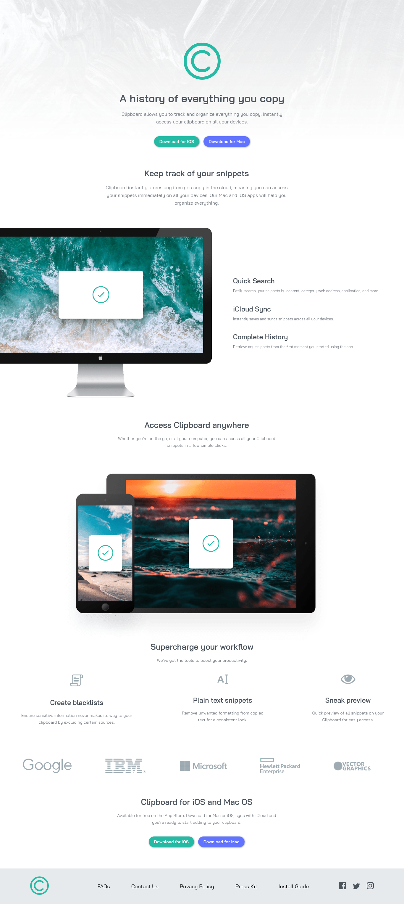
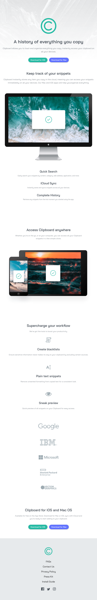
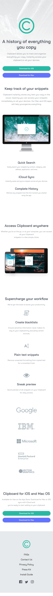

# Frontend Mentor - Clipboard landing page solution

This is a solution to the [Clipboard landing page challenge on Frontend Mentor](https://www.frontendmentor.io/challenges/clipboard-landing-page-5cc9bccd6c4c91111378ecb9). Frontend Mentor challenges help you improve your coding skills by building realistic projects.

## Table of contents

- [Overview](#overview)
  - [The challenge](#the-challenge)
  - [Screenshot](#screenshot)
  - [Links](#links)
- [My process](#my-process)
  - [Built with](#built-with)
- [Author](#author)

## Overview

### The challenge

I had a lot of fun working on this project! The nly challenge was to figure out how the spaces, widths, and heights since I didn't have the original design measurements, but overall I try to make it look as close as to the orginal design as I possibly could.

### Screenshot

- Desktop: 
- Tablet: 
- Mobile: 

### Links

- Solution URL: [Source code](https://github.com/jfcode101/frontend-mentor-challenges/tree/main/clipboard-landing-page)
- Live Site URL: [Github page](https://jfcode101.github.io/frontend-mentor-challenges/clipboard-landing-page/index.html)

## My process

### Built with

- Semantic HTML5 markup
- CSS custom properties
- Flexbox
- Responsive Web Design

## Author

- Website - [DevJFD](https://devjfd.com/)
- Frontend Mentor - [@JFcode101](https://www.frontendmentor.io/profile/jfcode101)
