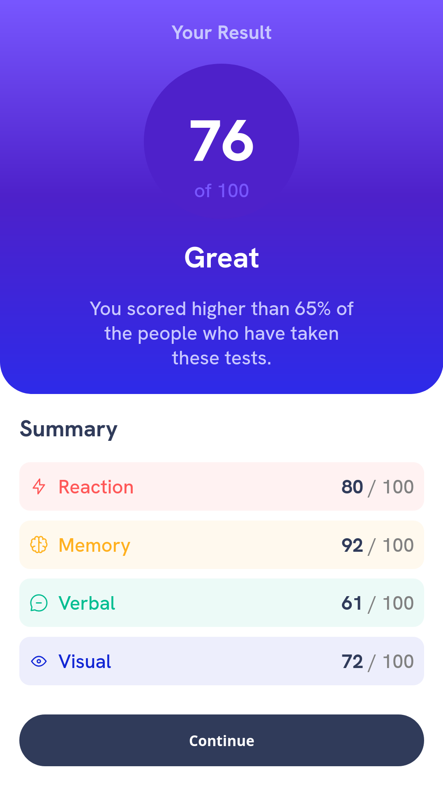

# Frontend Mentor - Results summary component solution

This is a solution to the [Results summary component challenge on Frontend Mentor](https://www.frontendmentor.io/challenges/results-summary-component-CE_K6s0maV). Frontend Mentor challenges help you improve your coding skills by building realistic projects.

## Table of contents

- [Overview](#overview)
  - [The challenge](#the-challenge)
  - [Screenshot](#screenshot)
  - [Links](#links)
- [My process](#my-process)
  - [Built with](#built-with)
  - [Useful resources](#useful-resources)
- [Author](#author)

## Overview

### The challenge

Users should be able to:

- View the optimal layout for the interface depending on their device's screen size
- See hover and focus states for all interactive elements on the page

### Screenshot

- Desktop screenshot: 
- Mobile screenshot: 

### Links

- Solution URL: [Github](https://github.com/jfcode101/frontend-mentor-challenges)
- Live Site URL: [Github pages](https://jfcode101.github.io/frontend-mentor-challenges/results-summary/index.html)

## My process

- Take a really good look at the design
- Start with *HTML* 
- Then *CSS* 

### Built with

- Semantic HTML5 markup
- CSS custom properties
- Flexbox

### Useful resources

- [MDN web docs flexbox layout](https://developer.mozilla.org/en-US/docs/Learn/CSS/CSS_layout/Flexbox) -  Very usefully and helpfully resource in terms of 
refreshing my CSS Flexbox Knowledge. It has interactive feature which helps you see how things work and how one particular change is going to affect 
your layout. At end of the tutorial they have exercises that help you strengthen your knowledge.
- [w3schools flexbox](https://www.w3schools.com/csS/css3_flexbox.asp) - This is an amazing website has a **Try it Yourself** section which you can use to practice your CSS.
- [Markdown](https://www.markdownguide.org/) - I use this website to learn how to write **README** file

## Author

- Website - [Jean Fischer Dirimasi](https://devjfd.com/)
- Frontend Mentor - [@JFcode101](https://www.frontendmentor.io/profile/jfcode101)

