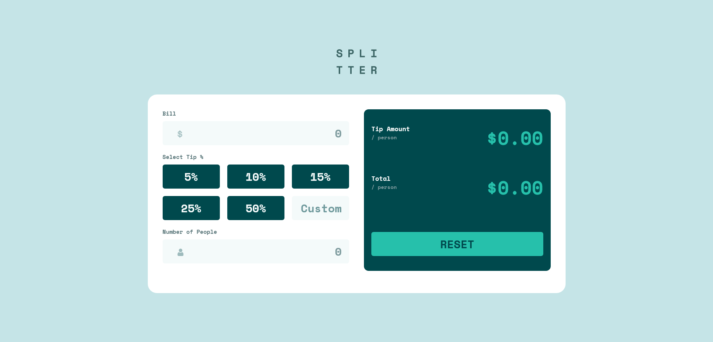

# Frontend Mentor - Profile card component

# Frontend Mentor - Profile card component solution

This is a solution to the [Tip calculator app challenge on Frontend Mentor](https://www.frontendmentor.io/challenges/tip-calculator-app-ugJNGbJUX). Frontend Mentor challenges help you improve your coding skills by building realistic projects.

## Table of contents

- [Overview](#overview)
- [The challenge](#the-challenge)
- [Screenshot](#screenshot)
- [Links](#links)
- [My process](#my-process)
  - [Built with](#built-with)
  - [Useful resources](#useful-resources)
- [Author](#author)

## Overview

### The challenge

Users should be able to:

- View the optimal layout for the app depending on their device's screen size
- See hover states for all interactive elements on the page
- Calculate the correct tip and total cost of the bill per person

### Screenshot

- Desktop screenshot: 
- Mobile screenshot: 

### Links

- Solution URL: [Github](https://github.com/jfcode101/frontend-mentor-challenges/tree/main/tip-calculator-app)
- Live Site URL: [Github pages](https://jfcode101.github.io/frontend-mentor-challenges/tip-calculator-app/index.html)

## My process

- Inspect the design
- Start with `HTML`
- Then style the document using `CSS`
- Last, add `javaScript` to dynamically update the app content

### Built with

- Semantic HTML5 markup
- CSS custom properties
- Flexbox
- CSS Grid
- HTML Forms
- Vanilla JavaScript

### Useful resources

- [MDN Web Docs](https://developer.mozilla.org/en-US/) - is a very usefully and helpfully resource. **MDN Web Docs** offers an extensive range of resources for developers. It provides in-depth documentation on web standards such as `HTML`, `CSS`, and `JavaScript`, and much more.

- [w3schools](https://www.w3schools.com) - is an amazing tutorial website that has a **Try it Yourself** section allowing you to practice the subject you're currently learning.
- [Markdown](https://www.markdownguide.org/) - offers details lesson on writing `.md` files

## Author

- Website - [Jean Fischer Dirimasi](https://devjfd.com/)
- Frontend Mentor - [@JFcode101](https://www.frontendmentor.io/profile/jfcode101)
